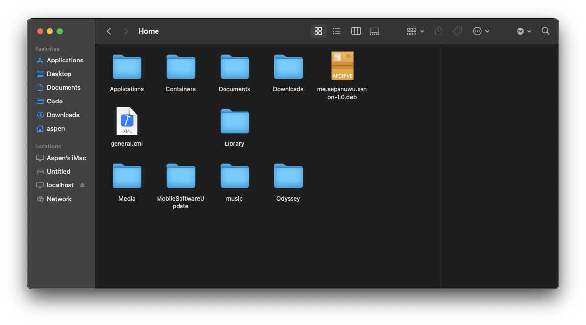
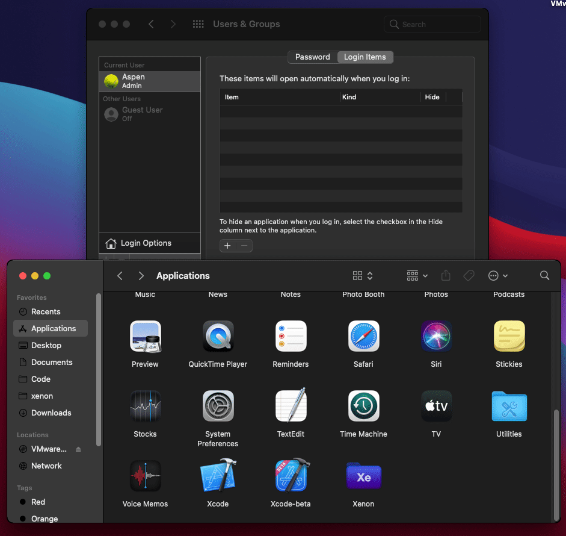

Hello there! You're probably here because you're using my Xenon file-sharing tweak for iOS, and you're wondering how it works! I've come across many of the edge cases and weird issues people have had during testing, so I've put together this to help you ensure that everything works.

# FIX FOR "Xenon Daemon Not Running"

In tweak version 1.0.0, there is a major bug that occurs on new installs, resulting in "Xenon Daemon not running".

There are two ways to fix this:
 - Create the `/var/mobile/Library/me.aspenuwu.xenon` folder in Filza
OR
 - Run the following commands over SSH:
```bash
mkdir /var/mobile/Library/me.aspenuwu.xenon
chown mobile /var/mobile/Library/me.aspenuwu.xenon
```
The `chown` is not needed if you are SSH'd in as the `mobile` user, but it IS needed if you are `root`.

# Table of contents

<!--ts-->
   * [Client Downloads](#client-downloads)
   * [Pairing](#pairing)
   * [How do I access my files?](#wait-how-do-i-access-my-files)
   * [Launching Xenon on startup](#launching-xenon-on-startup)
     * [Windows](#windows)
     * [macOS](#macos)
     * [Linux](#linux)
   * [Mounts](#mounts)
     * [Folder Path](#folder-path)
     * [Preset](#preset)
     * [iCloud Bundle](#icloud-bundle)
     * [App Bundle](#app-bundle)
   * [Troubleshooting](#debugging)
     * [Pairing - Ensure your device and computer are on the same network](#pairing---ensure-your-device-and-computer-are-on-the-same-network)
     * [Pairing - Allow Xenon through Windows Firewall](#pairing---allow-xenon-through-windows-firewall)
     * [Pairing - If all else fails...](#pairing---if-all-else-fails)
     * [General - Viewing the logs](#general---viewing-the-logs)
     * [General - Enabling debug logs in the Xenon client](#general---enabling-debug-logs-in-the-xenon-client)
<!--te-->

# Client Downloads

The first thing you need is, of course, the Xenon client for your computer!

[These are located in this repo's releases, which can be accessed by clicking here.](https://github.com/aspenluxxxy/xenon-docs/releases/latest)

# Pairing

Usually, pairing in Xenon is simple. To begin the process, you need to click the "Pair Device" in the Xenon client's system tray menu.

 

This should open a QR Code in your computer's default image viewer. Keep that open for the next step.

Next, you need to go to the Xenon preferences on your iOS device, and select "Pair Computer". 


This will bring up your camera, which you should use to scan the QR Code. If successful, your device should vibrate, and you will get a notification on your computer!


However, this may not always succeed automatically, due to the variety of network and computer setups people have, but this is fine, this is not the only way to pair. If so, try the advice given in the [Troubleshooting](#troubleshooting) section.

# Wait, how do I access my files?

Normally, Xenon should add itself to your native file explorer on Windows/Linux after connecting and sending a notification.

On macOS, you may get an "unsecure connection" prompt - accept this and log in as a guest. Do not worry, this is simply due to the way that Xenon tells your own computer about itself, **the actual connection to your phone is secure**!

However, if you do not get this prompt automatically, you will need to manually add the Xenon client to your file explorer. This is an easy process, you will simply need to remember the URL "**http://localhost:4200**" (change port 4200 if you changed it in `config.toml`), and follow the appropiate guide. **Do note that there is no username/password**:

 * [Windows](https://www.maketecheasier.com/map-webdav-drive-windows10/) ([archive](https://web.archive.org/web/20210228173318/https://www.maketecheasier.com/map-webdav-drive-windows10/))
 * [macOS](https://support.apple.com/guide/mac-help/connect-disconnect-a-webdav-server-mac-mchlp1546/mac) ([archive](https://web.archive.org/web/20210228173041/https://support.apple.com/guide/mac-help/connect-disconnect-a-webdav-server-mac-mchlp1546/mac))
 * [Linux / Ubuntu](https://help.dreamhost.com/hc/en-us/articles/216473527-Accessing-WebDAV-with-Mac-OS-X-and-Linux) ([archive](https://web.archive.org/web/20210228173600/https://help.dreamhost.com/hc/en-us/articles/216473527-Accessing-WebDAV-with-Mac-OS-X-and-Linux))


## Launching Xenon on startup

It's possible to automatically launch the Xenon server when logging on!

### Windows

1. Press the Windows key and R at the same time.
2. The Run menu should pop up, type in `shell:startup` and press enter


3. Drag and drop your `xenon-client.exe` into the resulting folder!


## macOS

1. Launch System Preferences
2. Select "Users & Groups"
3. Go to "Login Items" under your user
4. Drop the Xenon app into the list



## Linux

The packages for Xenon should come with a systemd user service, so just `sudo systemctl enable --now --user xenon-client`.

# Mounts

Xenon has various ways to mount folders for your PC to see!

## Folder Path

You can directly mount a folder path using this mount type - such as `/`, `/Applications`, `/var`, etc.

## Preset

Xenon comes with several presets for folders that people would commonly use:

 * **On-Device Photos**: Mounts all on-device photos as a single, **read-only** folder. You cannot add new photos, just downloading them onto your PC.
 * **'On my iPhone' Files**: Mounts the local "On my iPhone" you'd see in the stock Files app.
 * **Documents**: Mounts `/var/mobile/Documents`, used by some tweaks and apps such as PojavLauncher for storing data and configuration.
 * **Home (/var/mobile)**: This is a shortcut for directly mounting `/var/mobile`, the "home" folder of iOS, equivalent to `/Users/user` on macOS and `/home/user` on Linux.

## iCloud Bundle

This mounts the iCloud-synced data and configuration of an app.

## App Bundle

This mounts the local data and configuration of an app.

# Troubleshooting


Of course, you may still have issues. If so, there are steps you can take to figure out the issue, or help me fix it!
## Pairing - Ensure your device and computer are on the same network

Your device and the computer you wish to pair must be on the same network - connected to the same modem/router. It does not matter *how* they're connected - Ethernet/Wifi/Powerline adapter, doesn't matter - but they cannot be connected to separate networks, such as mobile data. 

Tutorials for checking local IP / network on...
 * [iOS](https://confluence.uconn.edu/ikb/communication-and-collaboration/phone/cellular-services/finding-the-ip-address-for-an-ios-device) ([archive](https://web.archive.org/web/20210228171900/https://confluence.uconn.edu/ikb/communication-and-collaboration/phone/cellular-services/finding-the-ip-address-for-an-ios-device))
 * [Windows 10](https://support.microsoft.com/en-us/windows/find-your-ip-address-f21a9bbc-c582-55cd-35e0-73431160a1b9) ([archive](https://web.archive.org/web/20210228172013/https://support.microsoft.com/en-us/windows/find-your-ip-address-f21a9bbc-c582-55cd-35e0-73431160a1b9))
 * [macOS](https://ccm.net/faq/42628-mac-os-x-how-to-find-your-public-or-local-ip-address) ([archive](https://web.archive.org/web/20210228172057/https://ccm.net/faq/42628-mac-os-x-how-to-find-your-public-or-local-ip-address))
 * [Linux](https://phoenixnap.com/kb/how-to-find-ip-address-linux) ([archive](https://web.archive.org/web/20210228172132/https://phoenixnap.com/kb/how-to-find-ip-address-linux))

## Pairing - Allow Xenon through Windows Firewall

If you're using Windows, the Windows Firewall is known to cause issues with the pairing process.

To ensure that Xenon is allowed network access, follow these steps:

 1. Open up the Start Menu
 2. Search "Windows Firewall"
 3. Select "Windows Defender Firewall"  
 
 4. Click "Allow an app or feature through Windows Defender Firewall"  
 
 5. Click "Change Settings"  
 
 6. Scroll down until you find "The client for Xenon...", and ensure that both "Private" and "Public" are checked for it.  
 
 7. Select "Ok" to save your new firewall configuration.

This should allow Xenon to pair!

## Pairing - If all else fails...

If nothing can get your device to automatically pair with your computer, do not fret! There is still a way to manually pair your device.

 1. Go to the Xenon preferences on your device.
 2. Select "Copy Client Configuration" - this will copy to your clipboard.
 3. Now, send the contents of your clipboard to your PC somehow - emailing it to yourself, sending it somewhere private on Discord (like a bot's DM), or perhaps using [Boardy](https://chariz.com/buy/boardy).
 4. Select "Open Config" from the client's system tray menu, or if that does not work, "Open Config Folder" from the system tray menu.


"Open Config" works if your computer can open .toml files, otherwise you will need to go to the folder and open `config.toml` in a text editor.


 5. Replace the entire `[connection]` section with the section that the preferences copied to your clipboard. This should have the same format - but with your phone's local IP, hostname, and public key.
 6. Save your changes  to `config.toml`.
 7. Quit and re-open the Xenon client. It should now be succesfully paired!

Once this has been set up, it will appear in your file explorer as "DavWWWHost" (Windows) or "localhost" (macOS)

Don't forget to actually add mounts in the Xenon preferences, else it'll just be a blank folder!

## General - Viewing the logs

The Xenon client logs to a file called `xenon-client.log` by defualt. It is quite easy to view this log file, which will say if the client encountered any errors or issues.

You need to open the Tray Icon and click "View Log"


This should open a log file using a text editor, allowing you to see what Xenon did and how it may have errored!


## General -  Enabling debug logs in the Xenon client

By enabling debug logs, you can see what it is doing in more detail!

First, you must select "Open Config" from the client's system tray menu, or if that does not work, "Open Config Folder" from the system tray menu.


"Open Config" works if your computer can open .toml files, otherwise you will need to go to the folder and open `config.toml` in a text editor.


You want to change `log-level` from `info` to `debug`. Ensure that `debug` is still inside quotations, like so:

```toml
log-level = 'debug'
```

Now, once you save that file, you can quit and re-open the Xenon client, and debug logs will be enabled, resulting in more detailed logs!
