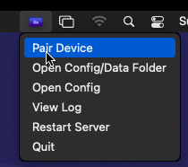
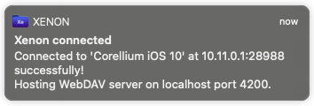

Hello there! You're probably here because you're using my Xenon file-sharing tweak for iOS, and you're wondering how it works! I've come across many of the edge cases and weird issues people have had during testing, so I've put together this to help you ensure that everything works.

# Table of contents

<!--ts-->
   * [Pairing](#pairing)
     * [Troubleshooting issues with pairing](#troubleshooting-issues-with-pairing)
       * [Ensure your device and computer are on the same network](#ensure-your-device-and-computer-are-on-the-same-network)
       * [Allow Xenon through Windows Firewall](#allow-xenon-through-windows-firewall)
<!--te-->

# Pairing

Usually, pairing in xenon is simple. To begin the process, you need to click the "Pair Device" in the Xenon client's system tray menu.

 

This should open a QR Code in your computer's default image viewer. Keep that open for the next step.

Next, you need to go to the Xenon preferences on your iOS device, and select "Pair Computer". 

This will bring up your camera, which you should use to scan the QR Code. If successful, your device should vibrate, and you will get a notification on your computer!

However, this may not always succeed automatically, due to the variety of network and computer setups people have, but this is fine, this is not the only way to pair. 

## Troubleshooting issues with pairing

### Ensure your device and computer are on the same network

Your device and the computer you wish to pair must be on the same network - connected to the same modem/router. It does not matter *how* they're connected - Ethernet/Wifi/Powerline adapter, doesn't matter - but they cannot be connected to separate networks, such as mobile data. 

Tutorials for checking hecking local IP / network on...
 * [iOS](https://confluence.uconn.edu/ikb/communication-and-collaboration/phone/cellular-services/finding-the-ip-address-for-an-ios-device)
 * [Windows 10](https://support.microsoft.com/en-us/windows/find-your-ip-address-f21a9bbc-c582-55cd-35e0-73431160a1b9)
 * [macOS](https://ccm.net/faq/42628-mac-os-x-how-to-find-your-public-or-local-ip-address)
 * [Linux](https://phoenixnap.com/kb/how-to-find-ip-address-linux)

### Allow Xenon through Windows Firewall

If you're using Windows, the Windows Firewall is known to cause issues with the pairing process.

To ensure that Xenon is allowed network access, follow these steps:

 * Open up the Start Menu
 * Search "Windows Firewall"
 * Select "Windows Defender Firewall"  
 
 * Click "Allow an app or feature through Windows Defender Firewall"  
 
 * Click "Change Settings"  
 
 * Scroll down until you find "The client for Xenon...", and ensure that both "Private" and "Public" are checked for it.  
 
 * Select "Ok" to save your new firewall configuration.

This should allow Xenon to pair!